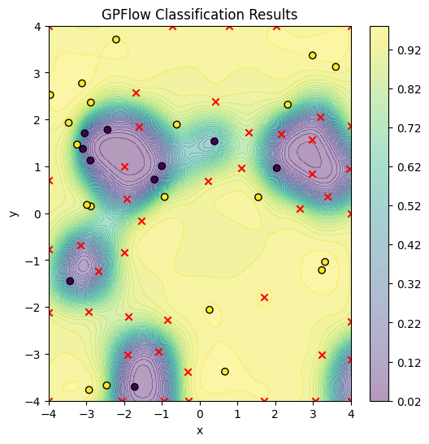
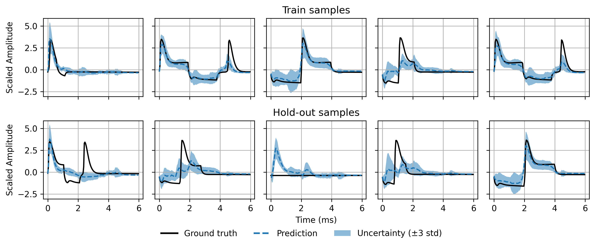
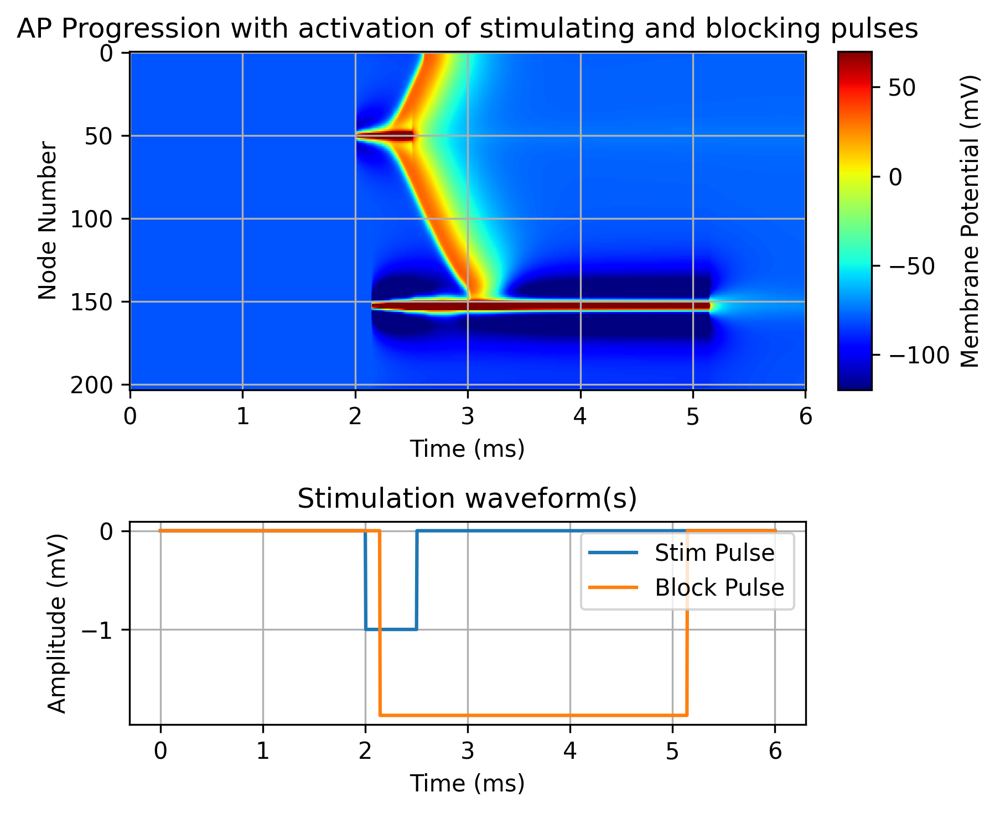

# Online neuro


A Bayessian Optimization library for optimization problems for neural simulations.
This release works for Axonsim (Matlab) and Cajal/AxonML (Python).

## Install requirements

```bash
# Install virtualenv
pip install virtualenv

# Create a virtual environment named venv
virtualenv venv

# Activate the virtual environment
# On Linux or macOS
source venv/bin/activate

# On Windows
venv\Scripts\activate

# Install required packages
pip install -r requirements.txt
```

### Matlab
In case you want to solve Matlab problems (e.g. Axonsim), install the required matlab engine (the default pip wheel is currently Matlab 2026a).

You can check the version by opening MATLAB and running the command: version

So for instance, if you don't have 2024a version, but your engine for Matlab is 2023b you can run the following command:

```bash
# Install matlabengine for Matlab version 2023b
pip install matlabengine==23.2.3

# Or in the case of 2024a
pip install matlabengine==24.1.2
```

For more information: https://pypi.org/project/matlabengine/

### Neuron, Cajal and AxonML
- Install Cajal following the instructions:
[Github-Cajal](https://github.com/wmglab-duke/cajal)

- Install AxonML following the instructions:
[Github-AxonML](https://github.com/wmglab-duke/axonml)

*Note*: You will likely need to first install MPI4 in your system ([MPI4 ReadTheDocs](https://mpi4py.readthedocs.io/en/stable/install.html)). This is described in the [Cajal installation instructions](https://github.com/wmglab-duke/cajal?tab=readme-ov-file#-requirements). Then install mpich using pip:

```bash
apt install -y mpich
```

## How to start


### GUI
#### Path configuration
Make sure that the **path_configuration** in [configuration file](config.json) is complete. Most importantly, specify the paths to the simulators (axonsim_path, cajal_path and axonml_path) as needed. Optionally, specify the **save_path** to the folder where you want to save the results.

In Linux
```shell
sh run.sh
```

In Windows[^1]  open the file directly or from terminal:
```bash
.\run.bat
```

- The bash script takes care of adding the required folders to PYTHONPATH and calls /api/app.py
- Open the interface within a browser per default: [https:localhost:9000](https:localhost:9000), or the one specified in the configuration file.

More details on the GUI usage bellow.

### Terminal
First install online-neuro as a package, or, add its folder in the Python path of your environment. Run an experiment as follows:

```py
python3 api/app.py -FLAGS
```

Flags:
```
options:
  -h, --help            show this help message and exit
  --target {Python,MATLAB}
                        Specify the target simulator: 'Python' or 'MATLAB'
  --flask_port FLASK_PORT
                        If provided, partial results are sent to the flask
                        server for plotting and reporting
Global configuration:
  --config CONFIG       Path to or JSON string of the global configuration
Specific configurations:
  --connection_config CONNECTION_CONFIG
                        Path to or json string of the connection's configuration
  --model_config MODEL_CONFIG
                        Path to or json string of the model's configuration
  --problem_config PROBLEM_CONFIG
                        Path to or json string of the problems's configuration
  --optimizer_config OPTIMIZER_CONFIG
                        Path to or json string of optimizers's configuration
  --path_config PATH_CONFIG
                        Path to or json string of paths's configuration
```
Configuration flags can accept text or file paths. It is easier and more readable to pass file paths.
For more specifications, use the examples in [config folder](config) and the [config readme.md](config/README.md)

## Toy Problems

### Circle
**Description**: Classification problems where one or multiple circles need to be detected in a 2-dimensional search space. These problems can be be modelled with SVGP and log-likelihood.

**Simulator(s)**: [Python](/simulators/python/problems/toy_problems.py) and [Matlab](/simulators/matlab/problems/circle_problem.m)

**GUI**: Yes

**Notebooks**:
- [Multiple circles](/notebooks/Multiple%20circles.ipynb)
- [Single circle](/notebooks/GP_binary%20example.ipynb)

#### Results





### Rosenbrock
**Description** A regression problem with smooth surfaces normally in a two inpust pace with predefined parameters a = 1 and b = 100.
**Simulator(s)**: [Python](/simulators/python/problems/toy_problems.py) and [Matlab](/simulators/matlab/problems/rosenbrock_problem.m)

**GUI** Yes

**Notebooks**
- None

##### Results


### Multiobjective
**Description** A two objective problem with two inputs. Optimizing towards joined targets using Pareto Front.
**Simulator(s)** MATLAB/Python
**GUI** Yes (Only MATLAB)

**Notebooks**
- [GP MOE](/notebooks/GP%20MoE.ipynb)

##### Results


## Axonsim problems
### Action potential modeling
**Description** A multioutput regression problem where the input parameters of a pulse are used to predict the time response of a fixed electrode.
**Simulator(s)** [MATLAB](/simulators/matlab/problems/axon_problem.m)
**GUI** Yes

**Notebooks**
- [Axonsim_AP_modelling](/notebooks/Axonsim_AP_modelling.ipynb)

##### Results


### Pulse nerve block
**Description** A classification problem using Sparse GP to discover configurations of two electrodes with single, double, or ramp pulses.
Objective is to generate an AP on one end and block its propagation.
**Simulator(s)** [MATLAB](/simulators/matlab/problems/axon_problem.m)
**GUI** Yes

**Notebooks**
- Not implement, see Cajal example instead

##### Results
- Pending.


## Cajal problems
Cajal is a Python axon simulator which has better interfacing than Axonsim (MATLAB).
Objective over time is to integrate more advance experiments in this section

### Pulse nerve block
**Description** A classification problem using Sparse GP to discover configurations of two electrodes with single, double, or ramp pulses.
Objective is to generate an AP on one end and block its propagation.
**Simulator(s)** [Python](/simulators/python/problems/cajal_problems.py)
**GUI** Yes

**Notebooks**
-(GP Cajal AP blocking)[notebooks/GP_Cajal_AP_blocking.ipynb]

##### Results


### Pulse sinusoid delay
**Description** A regression problem using a GP/ANN to find parameters that model the time delay before the AP arrives to a given node, or the configuration that reaches it (minimization).
**Simulator(s)** [Python](/simulators/python/problems/cajal_problems.py)
**GUI** No

**Notebooks**
-(GP Cajal sinusoid delay)[notebooks/GP_Cajal_sinusoid_delay.ipynb]

##### Results

