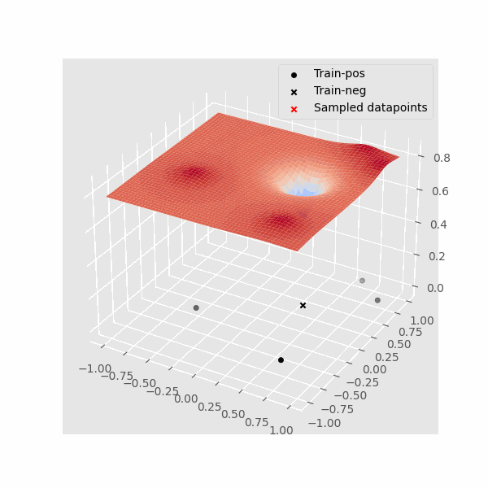
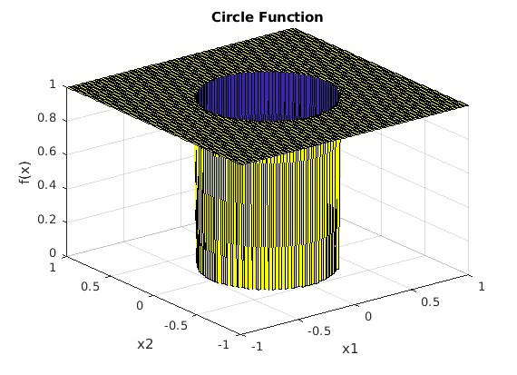
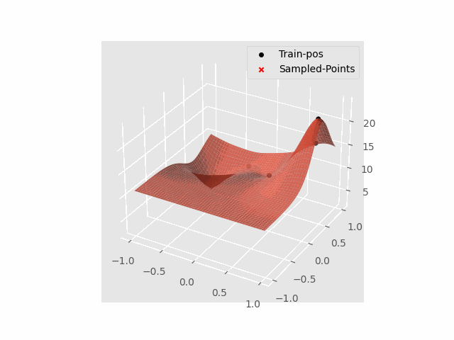
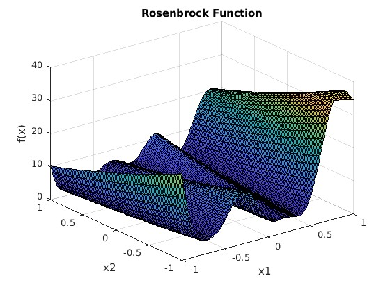
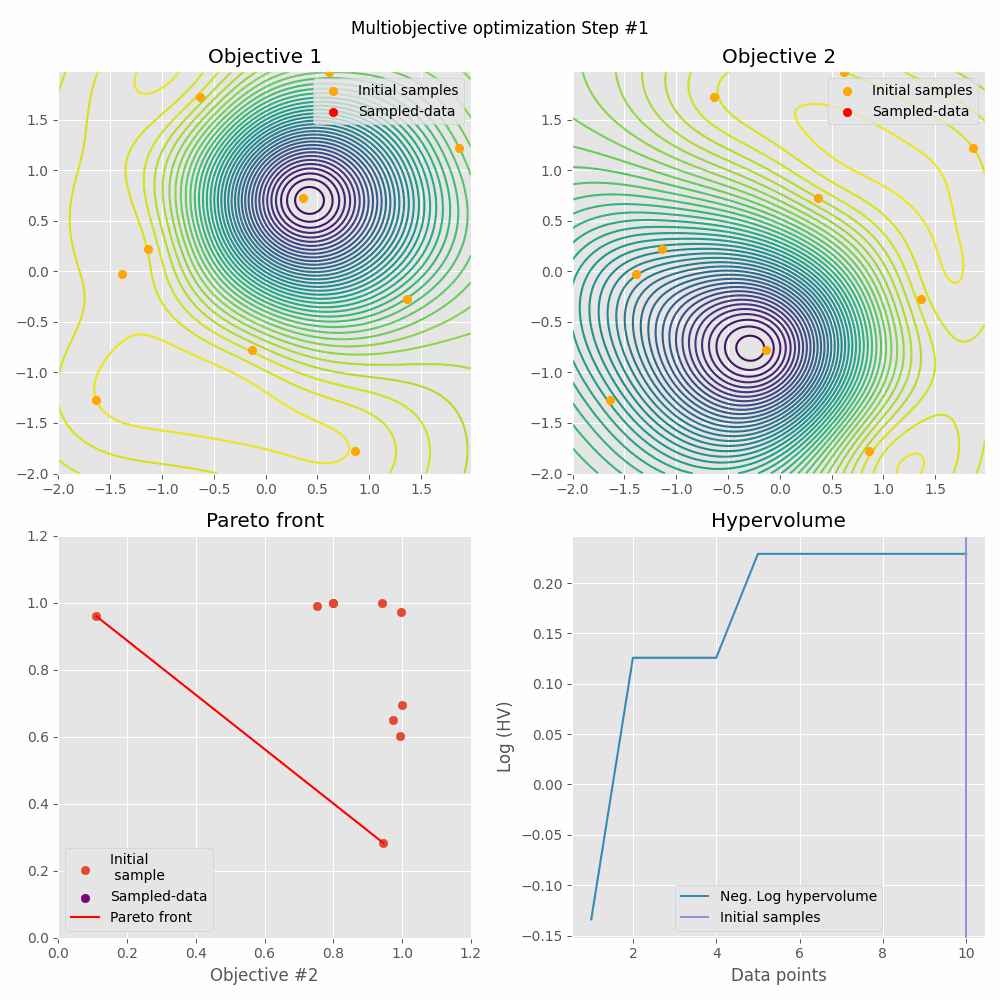
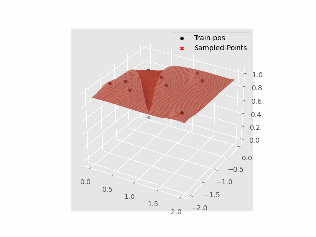

# Sim Interace


Optimized sampling for Matlab functions (or data acquisitions)

## Install requirements

```bash
# Install virtualenv
pip install virtualenv

# Create a virtual environment named venv
virtualenv venv

# Activate the virtual environment
# On Linux or macOS
source venv/bin/activate

# On Windows
venv\Scripts\activate

# Install required packages
pip install -r requirements.txt
```

### Matlab
In case you want to solve Matlab problems (i.e. Axonsim), install the required matlab engine (the default pip wheel is currently Matlab 2024a).

You can check the version by opening MATLAB and run the command: version

So for instance, if you don't have 2024a version, but your engine for Matlab is 2023b you can do the following command:

```bash
# Install matlabengine for Matlab version 2023b
pip install matlabengine==23.2.3

# Or in the case of 2024a
pip install matlabengine==24.1.2
```

For more information: https://pypi.org/project/matlabengine/

### Neuron, Cajal and AxonML
First install MPI4 in your system, followed by the installation using pip (included in the Cajal instructions):
```bash
apt install -y mpich
```


Install Cajal following the instructions:

Install AxonML following the instructions:

## How to start

### GUI

In Linux
```shell
sh run.sh
```
In Windows open the file directly or from terminal:
```bash
.\run.bat
```

- The bash script takes care of adding the required folders to PYTHONPATH and calls /frontend/app.py
- Open the interface within a browser per default: [https:localhost:9000](https:localhost:9000)

More details on the GUI usage bellow.

### Terminal
Either install online-neuro as a package, or, add its folder in the Python path.
Execute:
```py
python3 servers_side.py -FLAGS
```

Flags:
```
options:
  -h, --help            show this help message and exit
  --target {Python,MATLAB}
                        Specify the target simulator: 'Python' or 'MATLAB'
  --flask_port FLASK_PORT
                        If provided, partial results are sent to the flask
                        server for plotting and reporting
Global configuration:
  --config CONFIG       Path to or JSON string of the global configuration
Specific configurations:
  --connection_config CONNECTION_CONFIG
                        Path to or json string of the connection's configuration
  --model_config MODEL_CONFIG
                        Path to or json string of the model's configuration
  --problem_config PROBLEM_CONFIG
                        Path to or json string of the problems's configuration
  --path_config PATH_CONFIG
                        Path to or json string of paths's configuration
```
Configuration flags can accept text or files. It is certainly easier and more readable to pass file paths.
Use the examples in ./config/ folder

## Configuration
Using the GUI there's no need of writing any code. However, you may want to modify some of the default configurations.
The code is written in a way that minimum changes are required in the script.

All parameters (connection and optimization) are selected in the config.json.
Bellow is the example of the config.json

Note: Right now (Nov 2024) the model is fully in the backend, to modify it use the global configuration file: config.json
More details on the config files are in the [config readme.md](config/README.md)

```json
{
  "connection_config": {
    "ip": "127.0.0.0",
    "port": 10000,
    "Timeout": 20,
    "ConnectTimeout": 30,
    "SizeLimit": 1048576,
    "target": "MATLAB"
  },
  "problem_config": {
    "experiment": {
      "name": "EXPERIMENT",
      "type": "classification/regression",
      "config_path": "PATH"
    }
  },
  "model_config": {
    "type": "VGP",
    "classification": true,
    "scale_inputs": true,
    "constrains": false,
    "sparse": false,
    "variational": true,
    "noise_free": true,
    "trainable_likelihood": false,
    "init_samples":15,
    "batch_sampling": false,
    "num_query_points": 1
  },
  "path_config": {
    "save_path": "./simulations",
    "benchmark_path": "./benchmarks",
    "axonsim_path": "../AxonSim-r1-main/"
  }
}
```

## Toy Problems

### Circle

A classification problem that can be modelled with SVGP and log-likelihood.




<!--   -->

### Rosenbrock
A regression problem with smooth surfaces approximated with GP.




<!--  -->

### Multiobjective

A two objective problem with two inputs. Optimizing towards joined targets using Pareto Front.
% TODO is there a way to set up the constraints from matlab's end and pass them to Python?




## Axonsim

### Single pulse detection
A classification problem using SVGP to detect the minimum currrent/pulse duration to generate an AP.


### Double pule nerve block
A classification problem using SVG to discover configurations of two electrodes with single (inverted).
Objective is to generate an AP on one end and block its propagation.

### Single pulse and ramp pulse block
A classification problem using SVG to explore a high parameter space (ramp configuration) to allow for the block of an AP
%TODO need to add figures here

The problem can be simplified by fixing the parameters of the single pulse (notice that electrodes interact with each other).

## AxonML


## Other sources
