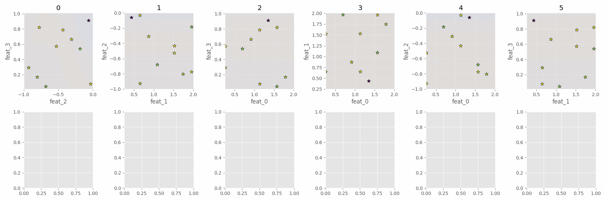
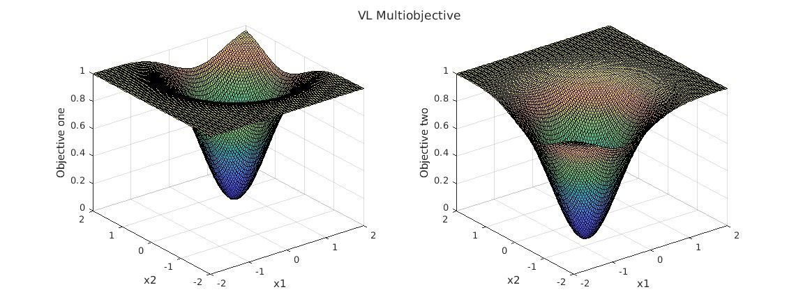

# Sim Interace


Optimized sampling for Matlab functions (or data acquisitions)

## Install requirements

```bash
pip install -r requirements.txt
```
In addition, install the required matlab engine (the default pip wheel is currently Matlab 2024a)

For example, the engine for Matlab 2023b:
```bash
pip install matlabengine==23.2.3
```


https://pypi.org/project/matlabengine/

## Usage

```py
TBD
```

```bash
$ python3 ./server_side.py --matlab_call
#or
# $ matlab main 
```

## Configuration
The code is written in a way that minimum changes are required in the script.
All parameters (connection and optimization) are selected in the config.json
```json
{
  "ip":"127.0.0.1",
  "port":55131,
  "Timeout":20,
  "ConnectTimeout":30,
  "save_path": "./simulations",
  "problem": "rose",
  "experiment": {
    "classification": false,
    "sparse": false,
    "variational": true,
    "init_samples":5,
    "noise_free": true,
    "batch_sampling": false,
    "trainable_likelihood": false
  }
}
```
- **Problem** The problem to be solved. Accepts 'circle', 'rose', and 'axon'.

- **Classification** Defines whether the problem is a classifier or a regression.
- **Sparse, Variational** Booleans that define the type of Gaussian Process
- **init_samples** Number of initial samples to request in the beginning/start model.
- **noise_free** It should be kept as true. (TODO add discussion as to why later)
- **batch_sampling** It should be kept as false. (TODO needs to be implemented).
- **trainable_likelihood** Whether the likelihood of the model is trainable. In most cases should be kept as false.

## Toy Problems
### Circle
A classification problem approximated sith SVGP and log-likelihood.

 


<!--   -->
### Rosenbrock
A regression problem with smooth surfaces approximated with GP.

 


<!--  -->

### Multiobjective
A two objective problem with two inputs. Optimizing towards joined targets using Pareto Front.
% TODO is there a way to set up the constraints from matlab's end and pass them to Python?
 

## Axonsim
A classification problem using SVG to detect the minimum currrent/pulse duration to create an AP.
%TODO need to add labels to the axis of these plots


## Other sources